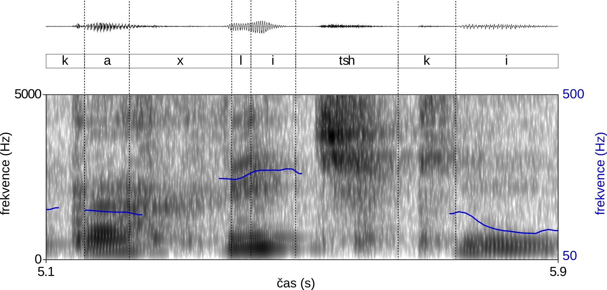
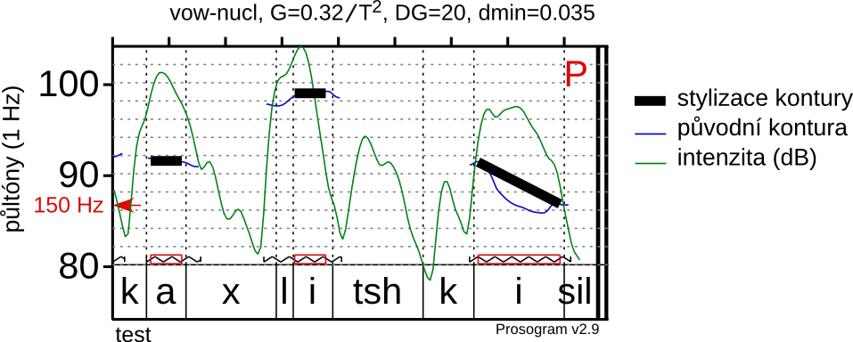

---
title: Intonační vzorce v neformální češtině na datech z mluveného korpusu
csl: iso690-author-date-cs.csl
author: David Lukeš
...

<!--
(progn
  (while
    (search-forward ",," nil t)
    (replace-match "„"))
  (while
    (search-forward "``" nil t)
    (replace-match "“")))
-->

Úvod
====

Na rozdíl od korpusů psaných, které badateli skýtají „jen“ shromážděná, ale
jinak relativně nezkreslená data o podobě psaného jazyka,[^1] jsou korpusy
mluveného jazyka od svého vzniku zatíženy prvotním interpretačním aktem,
tj. transkripcí. Přímá využitelnost surových zvukových dat je pro lingvistu
malá, potřebuje jejich symbolický přepis, který pak může zkoumat v propojení se
zvukem či sám o sobě. Ten je ovšem zčásti ovlivněn subjektivními pohledy
skupiny anotátorů, kteří se navíc mohou rozcházet (problém **reliability**), či
hůře, navzájem se sice shodovat, ale míjet se s realitou
[problém **validity**, @artstein+08, 556--7]. S aktuálním projektem mluveného
korpusu ORTOFON [budovaného na ÚČNK, @koprivova+14] přitom natolik stoupla
kvalita nahrávek, že už lze pomýšlet na alespoň částečné zpracování
počítačovými metodami analýzy řeči. Jednou z oblastí, kde by bylo nadmíru
přínosné tyto postupy uplatnit, je intonace[^5].

<!-- popsat pak výsledky jako konstrukce v rámci CxG? -->

Náš projekt materiálově cílí na nahrávky z výše zmíněného korpusu ORTOFON a jeho
východiskem by mělo být **automatické rozpoznání kontur[^8] základní frekvence**
(F0), která je primárním akustickým korelátem intonace, vytipování intonačně
zajímavých míst v textu a **kvantitativní analýza** (*clusterování*) kontur,
které se na nich vyskytují. Kategorie (široké skupiny podobných kontur), které z
této analýzy vyvstanou, budou základem pro těžiště práce, jež bude spočívat v
**lingvistickém popisu** některých intonačních vzorců hojně využívaných v
neformální mluvené češtině. V závislosti na povaze materiálu získaného během
*clusterování* může tento popis obsahovat návaznost na lexikální rovinu,
syntaktické vlastnosti, pragmatiku či sociolingvistickou charakteristiku
intonačních vzorců (včetně dlouhodobějších ukazatelů jako jsou průměr, rozpětí a
variabilita F0).[^6] Ukáží-li se výsledky jako užitečné pro běžného uživatele
korpusu z hlediska vyhledávání v mluvených textech, v duchu této klasifikace by
pak mohly být zpětně anotovány odpovídající kontury ve veřejně dostupné verzi
korpusu. Doplnění lingvistických informací, v nichž je zásah anotátora minimální
nebo alespoň prokazatelně konzistentní, by badatelům poskytlo nový prostor pro
výzkum a validní generalizace.

<!-- POZOR: -->
<!-- do socling popisu v podstatě spadá i analýza dlouhodobých charakteristik -->
<!-- intonace -- mean, range, variability (Patel) apod. -->

Teoretický popis intonace
-------------------------

<!-- najít, co citovat od Cruttendena, Bolingera a spol. -->

<!-- Bolinger ne britská škola!!! Amík -->

V moderním fonologickém popisu intonace převládají dva přístupy. První,
tradiční, je založen na holistickém pojetí a intonaci analyzuje jako spojitou
konturu, ukotvenou na klíčových místech na segmentálním materiálu promluvy.
Tento přístup je spojen např. se známou britskou školou (Cruttenden, Bolinger,
aj.) či s badateli z Institutu pro výzkum percepce (IPO) v nizozemském
Eindhovenu [@thart+90]. Konturový popis vyšel původně z potřeb poslechové
analýzy intonace, ale je využitelný i v exaktních instrumentálních oblastech
výzkumu, jak dokládá např. Fujisakiho produkční model založený na superpozici
frázových a přízvukových kontur [-@fujisaki+69].

Oproti tomu novější tonální přístup převádí souvislou[^9] křivku hlasové melodie
na sled diskrétních intonačních událostí (bodů), jejichž specifikace má
fonologickou relevanci. Jejich propojení a přechody mezi nimi jsou pak čistě
záležitostí nízkoúrovňové fonetické implementace: neodvozují se od
jazykově-systémových, funkčních kritérií, nýbrž od fyziologických restrikcí a
snahy při mluvě ušetřit námahu. Tím pádem lze místo často *ad hoc* vyčleňovaných
kontur ustanovit úzký fonologický inventář tónů (v původní koncepci jen jeden
vysoký, H, a jeden nízký, L) a pokusit se pozorovanou variabilitu rozložit na
tyto prvočinitele, což má výsledné teorii poskytnout vyšší explanatorní sílu.
Tonální pojetí intonační fonologie se zrodilo v disertační práci
Pierrehumbertové [-@pierrehumbert80] a jeho důraz na systematickou analýzu
pomocí vysoce abstraktních jednotek je z velké míry dědictvím generativního
přístupu k lingvistice. Zároveň je ale spjat s na poměry generativistů až
nezvyklým zájmem o empirii a její přesné pozorování: Pierrehumbertová hovoří o
nespolehlivosti impresionistické transkripce intonace a potřebě instrumentální
analýzy.

<!-- atd., viz lsl_tomas_dubeda.pdf. obrázky kontur a ToBI? -->

Může být matoucí, že i kontury jsou často graficky zachyceny jako sled
diskrétních úrovní či rovnou bodů, zejm. mluvíme-li o nich obecně, v absenci
konkrétní nahrávky (naproti tomu práce vzešlé z IPO, které skutečně systematicky
kladou důraz na empirický základ svých poznatků, vždy užívají souvislé čáry).
Důležité ale je, že jde o **ikonickou** reprezentaci, jinými slovy diagram čteme
tak, že vnímáme relativní vzdálenosti mezi body jako přímo úměrné variacím výšky
v původní intonační kontuře. Diskretizace má pak primárně napomoct jednoznačně
navázat konturu na jednotlivé slabiky v textu. Oproti tomu reprezentace v
tonálních přístupech je **symbolická**, tj. diskrétní už z principu, a sled
symbolů je interpretovatelný (převoditelný na představu o odpovídajícím průběhu
intonace) pouze pro někoho, kdo je obeznámen s jejich platností v rámci dané
teorie.

Je ovšem otázka, nakolik je celá tato distinkce užitečná. Pokud se podíváme
trochu pod povrch, v některých ohledech se stírá: kombinace tónů vlastně
reprezentují tonální pohyby, ať už mezi slabikami či v jejich rámci. Jak moc se
to v konečném důsledku reálně liší od intonačních kontur britské školy jako
*fall-rise*, *high-rise* apod.? Bylo by možná smysluplnější vést hranici mezi
přístupy zaměřenými na deskripci, konkrétno a fonetický detail, a přístupy
preferujícími explanaci, abstraktno a fonologičnost. Následně lze konstatovat,
že ty první dávají přednost konturám, zatímco ty druhé tonálním reprezentacím,
ale v této perspektivě už dokážeme vysvětlit, proč tomu tak je: kontury jako
metoda popisu přilehnou těsněji k původním datům a vyhovují tedy deskripci,
zatímco diskretizace pomocí inventáře tónů je sama o sobě krokem k abstrakci
(jejíž užitečnost může být sporná) a systematický fonologický popis usnadňuje,
neboť úkolem se stává vytvořit co nejelegantnější teorii s minimem jednotek a
pravidel, která zároveň dokáže uspokojivě vysvětlit všechna dostupná proven.

Intonace v češtině
------------------

Nejpropracovanější popis intonace v češtině je založen na konturách a představil
jej před více než půl stoletím František Daneš [-@danes57] ve svém fonologickém
systému kadencí (kadence, antikadence a polokadence), které se dále dělí na
různé realizační varianty. Tento model přitom má své metodologické meze: je
založen na introspekci, a jak sám autor podotýká, cílí při popisu intonace „na
jazyk spisovný ve funkci prostě sdělovací“ [@danes57, 7]. Takový materiál se
blíží spíše řeči čtené (spisovnost předpokládá jistou plynulost a
nepřerušovanost) a intonačně se od spontánních mluvených projevů může výrazně
lišit: některé rysy či vzorce budou hypertrofované, jiné naopak potlačené či
zcela nepřítomné. Bylo by tudíž záhodno doplnit tyto stávající znalosti o
poznatky nové, které budou zaměřené primárně na neformální mluvenou řeč a
založené na objektivní kvantitativní analýze autentického materiálu ze
sociolingvisticky vyváženého reprezentativního korpusu. Vzhledem k metodologické
i materiálové odlišnosti není primárním cílem vymezit se vůči Danešovu popisu,
<!-- (v mnohých ohledech nejsou oba výzkumné záměry -->
<!-- srovnatelné), -->
nýbrž poskytnout vhled do některých charakteristik české intonace
v běžné komunikaci a jejich případných odlišností napříč teritoriem České
republiky.

Danešův model doznal za dobu své existence několika spíše kosmetických či
terminologických změn, případně doplnění, zejm. ze strany Milana Romportla.
Současné pojetí, které v podstatných rysech odpovídá tomu klasickému a je dle
širokého konsenzu standardním popisem intonace v češtině, je shrnuto v knize
*Zvuková báze řečové komunikace* [@skarnitzl+16, 134--137]. Tři základní
fonologické kategorie se zde nazývají melodémy:

1. melodém ukončující klesavý (MUK, odpovídá Danešovu termínu kadence):
   charakteristický spjatý s intonací věty oznamovací a otázek doplňovacích (ty
   obsahují dedikované tázací slůvko, které účel věty naznačí, specifikace
   intonací je tedy redundantní a bývá rysem čteného projevu neškolených
   mluvčích)
2. melodém ukončující stoupavý (MUS, Danešova antikadence): typický pro otázky
   zjišťovací; stejně jako melodém ukončující klesavý se vyskytuje pouze ve
   finálním promluvovém úseku promluvy
3. melodém neukončující (MN, Danešova polokadence): vymezuje hranice nefinálních
   promluvových úseků v rámci promluvy, člení mluvčího projev a naznačuje jeho
   záměr udržet si slovo

Kadence se naopak říká jejich realizačním variantám, které mají o něco blíže ke
zvukové realitě; melodémy jsou spíše abstraktní funkční skupiny, jejich
„klesavost“ či „stoupavost“ nelze vždy brát doslova jako vyčerpávající popis
veškerých kontur, které pod ně spadají. U jednotlivých kadencí již má smysl
zakreslit schematickou reprezentaci odpovídající kontury, i proto, že pod
jednotlivé melodémy mohou patřit kadence se stejnými jmény, které se ale v oněch
různých funkcích v některých detailech liší (např. kadence stoupavo-klesavá u
MUK a MUS). Některé kadence mají i své příznakové varianty, které se vyznačují
rozšířením intonačního rozpětí v bodě nástupu melodému.

Charakterizací melodémů jako funkčních kategorií a kadencí jako realizačních
variant nechceme říct, že jednotlivé kadence nemohou být nositeli komunikačně
relevantních signálů: mohou mít např. vytýkací funkci, různé funkce pragmatické
či afektivní, nebo funkci indexovou (tj. jsou znakem sociolektu či dialektu
mluvčího). Tato variabilita se ovšem odehrává v rámci širší funkční kategorie
určené příslušností k danému melodému.

<!-- obr. kadence stoupavo-klesavé u MUK vs MUS? viz zbřk -->

Metoda
======

Stanovení cílových jednotek pro extrakci kontur
-----------------------------------------------

\label{target}

Zásadním rozdílem oproti navrhovanému projektu je, že ve výše jmenovaných
výzkumech byla pevně a předem stanovena místa, která byla považována z hlediska
intonace za relevantní. Tím byly určeny i hranice funkčních intonačních
jednotek, takže bylo jasné, které úseky křivky F0 brát jako ucelené kontury a
mezi sebou porovnávat. Šlo totiž o čtené [@raskinis+13] či poločtené
[tedy předem připravené na základě scénáře, @volin+14] projevy. Korpus ORTOFON
takovýmto členěním na intonačně relevantní úseky primárně nedisponuje,
prozodické předěly nejsou značeny plně systematicky (kladlo by to příliš vysoké
požadavky na přepisovatele) ani nejsou rozděleny na různé úrovně hloubky;
systematické (až mechanické) je jen značení pauz. Navíc lze předpokládat, že
mluva neformálních nepřipravených interakcí bude z tohoto hlediska výrazně méně
spořádaná, budou se vyskytovat i přerušované či nedokončené intonační celky
apod.

Je tedy třeba nejprve vytipovat, kde ucelené kontury v textu hledat: konkrétně
řečeno jde o **body** (tj. místa v promluvě, kde dochází k intonačně zajímavým
jevům) a **úseky** (tj. přesné rozpětí hlásek/slabik, na nichž se kontura
realizuje). Co se úseků týče, jako smysluplná jednotka se jeví výše zmíněný
mluvní takt, případně posloupnost taktů několika (dvou, tří -- jak dlouhé
sekvence je rozumné zkoumat, stanovíme empiricky). Jak bylo zmíněno výše, takty
jsou v korpusu ORTOFON značené a díky HTK budeme znát i jejich přesné hranice.

Při identifikaci typů míst v textu, kde lze předpokládat výrazné zapojení
intonace a na nichž má tudíž smysl kontury po taktech extrahovat a porovnávat,
můžeme vycházet z vlastní zkušenosti s přepisováním nahrávek pro korpus
ORTOFON. Následuje předběžný seznam, který bude při práci s materiálem dále
doplňován a upřesňován:

<!-- na základě vlastní zkušenosti s přepisováním nahrávek pro korpus ORTOFON -->

- místa s nápadnou emfází na slově či sekvenci slov (v korpusu ORTOFON značená
  pomocí složených závorek `{}`)
- místa s otázkou (značená `?`)
- místa, kde mluvčí imituje jiného mluvčího (značená `<IM ... >`), mluví nahlas
  (`<NH ... >`) či přímo křičí (`<KR ... >`) -- může souviset s nárůstem
  expresivity
  <!-- možná též půjde vyhledat podle sustained nárůstu intenzity v signálu -->
- konce promluv (tj. místa, kde jeden mluvčí domluví a všichni se na delší dobu
  odmlčí)
- místa před pauzou/předělem (značená `..`/`.`) -- ovšem pozor, intonačně
  zajímavý jev nemusí nutně nastat na posledním taktu před pauzou/předělem; jak
  si v rámci svého modelu všímá už Daneš [-@danes57, 27--30, viz níže], posuny
  tzv. intonačního centra z nepříznakové finální pozice v promluvovém úseku se
  dějí a jsou důležitým prostředkem aktuálního členění výpovědi
- místa se změnou artikulačního tempa (tempo půjde zjistit díky znalosti trvání
  jednotlivých hlásek) -- změna tempa je např. prostředkem k naznačení vsuvky,
  která může být signalizována i pomocí intonace
- je též možné začít od intonace -- soustředit se na takty, v jejichž rámci je
  výrazný intonační pohyb (velké rozpětí)
- v neposlední řadě bude přínosné se opřít i o přepis, zejména jeho lexikální
  charakteristiky, a porovnat intonační kontury spjaté s konkrétními jednotkami
  s jasnou pragmatickou relevancí -- např. partikulemi, tázacími dovětky nebo
  evaluativními adjektivy či adverbii

Rozpoznání F0 a propojení s přepisem
------------------------------------

Z technického hlediska je samotný odhad F0 poměrně spolehlivý, počítá se na
základě autokorelace signálu, což je velmi robustní algoritmus, nalezne
periodicitu i v silně zašuměném signálu. V podobě odladěné přímo pro výzkum
intonace už je navíc implementovaný a k dispozici v programech jako je např.
Praat [@boersma+14]. Zvukové nahrávky jsou však v korpusu ORTOFON vůči přepisu
zarovnané na příliš dlouhé jednotky (segmenty o maximální délce 25 slov), u
nichž nelze předpokládat, že by vždy nutně odpovídaly funkčně relevantním
intonačním celkům. Fonetický přepis sice obsahuje členění na mluvní takty, které
již z hlediska prozodie jsou smysluplnými jednotkami [@danes57, 23], ovšem je
potřeba najít ve zvukovém signálu jejich hranice.

<!-- místo HTK možná nakonec použiju Kaldi -->

K najití hranic hlásek poslouží volně dostupný soubor nástrojů pro rozpoznávání
řeči *Hidden Markov Model Toolkit* [HTK, @htkbook]. V našem případě nepůjde
přímo o rozpoznání řeči, nýbrž o úlohu řádově jednodušší, tzv. *forced
alignment*, neboť přepis již k dispozici máme a chceme pouze najít hranice slov
a hlásek v signálu (hranice taktů jsou podmnožinou hláskových hranic). Jde o
standardní postup, který se používá při trénování akustických modelů do
rozpoznávače, přičemž na vstupu je jen zvuk a časově nijak neanotovaný přepis.
Úloha bude o to lehčí, že není třeba časově alignovat vždy celou sondu najednou,
ale díky členění na segmenty ji můžeme rozřezat na krátké úseky, které se budou
zpracovávat jednotlivě. Jak ukazuje obr. \ref{kontura}, kde je vidět automatická
alignace slova „kachličky“ (v rámci delšího segmentu) pomocí výše popsané
metody, pilotní pokus na jedné sondě ze vznikajícího korpusu ORTOFON vypadá
slibně (porovnejte odhadnuté hranice hlásek zejména se spektrogramem).

<!--  -->

\begin{figure}
\centering
\includegraphics[width=.9\textwidth]{./figures/kontura.pdf}
\caption{Zvuková vlna (nahoře), přepis (uprostřed), spektrogram (dole) a
autokorelací odvozená intonační křivka (modrá čára) z části sondy
13A055N. Vertikální přerušované čáry naznačují hranice hlásek
automaticky stanovené pomocí sady nástrojů HTK.\label{kontura}}
\end{figure}

Může se pochopitelně stát, že signál bude v některých sondách či jejich částech
méně poddajný a výsledky automatické alignace tudíž horší. Taková místa lze
vytipovat jednak pravidlově (u sond je oznámkována celková kvalita nahrávky a
jsou v nich značeny např. překryvy vícero mluvčích či výslovnost se smíchem, což
jsou potenciálně problematické jevy), jednak stochasticky. Výstupem procesu
*forced alignment* je totiž i podmíněná pravděpodobnost
$P(p\check{r}epis|zvuk)$; ta bude v případě příliš velkého šumu, překryvů
mluvčích či obecně nekvalitního zvuku nižší, takže je možné stanovit hranici,
pod níž bude daný segment z dalšího zpracování a analýzy vyřazen. Zejména v
překryvech totiž bude i určování F0 nespolehlivé, neboť nepůjde rozlišit
jednotlivé mluvčí.

V tuto chvíli tedy disponujeme intonační křivkou alignovanou s hláskovým
materiálem. Je ovšem otázka, zda nezajít dál a ještě před analýzou nevyloučit
část percepčně irelevantní variace v intonačních vzorcích (drobné fluktuace,
mikrointonační jevy apod.). Následné analýzy by tedy pracovaly s tzv.
stylizovanými konturami, které lépe odpovídají percepčnímu vjemu intonace u
posluchače. Jedním takovým algoritmem, který umožňuje v programu Praat
automaticky generovat stylizace na základě průběhu F0 a dodané hláskové
segmentace, je tzv. prozogram
[@mertens04a; @mertens04b, viz obr. \ref{prozogram}]. Samotná percepční
stylizace je motivovaná dlouhou historií výzkumu percepce intonace zejména na
pracovišti IPO v Eindhovenu [@thart+90]. Shrňme si nejdůležitější postřehy z
tohoto oboru [dle @skarnitzl+16, 127--128]:

- percepce melodie řeči se odvíjí od hodnot F0 v rámci samohlásek; jako klíčová
  se ukazujej jejich druhá třetina [@hermes06]
- u krátkých samohlásek (do 100 ms) vnímaná hodnota odpovídá zhruba průměru F0 v
  druhé třetině samohlásky
- u delších je možné percepčně odlišit i případy, kdy se F0 v průběhu samohlásky
  pohybuje
- ve zbytku řečového materiálu jsou hodnoty F0 v percepci interpolovány, čímž
  vzniká dojem souvislé melodie řeči

<!-- obrázek znělých segmentů, který naznačí, kolik je toho třeba interpolovat? -->

<!-- vyzkoušet clusterování na obojím (styl i nestyl) + zjistit, která data se
na to lépe hodí (padají z nich "lepší" výsledky -- jak ale definovat "lepší"?) →
vedlejší výzkumný cíl -->

<!--  -->

\begin{figure}
\centering
\includegraphics{./figures/prozogram.pdf}
\caption{Percepční stylizace intonační kontury v obr. \ref{kontura},
tzv. prozogram.\label{prozogram}}
\end{figure}

Shluková analýza
----------------

Shluková analýza neboli **clustering** je exploratorní statistickou metodou,
jejíž užitečnost spočívá v tom, že umožňuje badateli provést prvotní orientaci v
datech, o jejichž povaze a struktuře má jen mlhavou představu. Cílem je nalézt
ve vzorku pozorování skupiny podobných případů, tzv. shluky, jejichž sdílené
vlastnosti jsou pak základem pro další analýzu a popis. Pod zastřešujícím
termínem „shluková analýza“ se skrývá několik postupů, které v zásadě variují
v následujících dvou bodech:

1. míra pro určení vzdálenosti mezi dvěma jednotlivými datovými body, příp. mezi
   datovým bodem a shlukem
2. algoritmus, který na základě této míry shlukuje body do skupin

Podívejme se nyní, jaké možnosti se u obou voleb nabízejí.

### Míry vzdálenosti

Vzdálenostní metrika exaktně kvantifikuje podobnost mezi dvěma pozorovanými
případy či skupinami případů. Její přesnost se kromě vhodnosti vybraného vzorce
pro dané užití odvíjí i od operacionalizace pozorovaného jevu. Není tedy vhodné
pozorování reprezentovat vysokorozměrným vektorem charakteristik, pro něž není
vždy teoretické odůvodnění, v bláhové víře, že si už metoda sama „přebere“ ty
důležité. Jestliže chceme provést clustering jako odrazový můstek k lingvistické
analýze jistých opakujících se vzorců (v našem případě intonačních), je klíčové
zvolit takovou parametrizaci, která bude věrně reflektovat strukturní a funkční
variabilitu, jež je ve středu našeho zájmu.

Z tohoto hlediska hraje důležitou roli při výzkumu intonace normalizace, a to
jak temporální (ve směru osy x), tak frekvenční (ve směru osy y). Nutnost
frekvenční normalizace je nabíledni, už kvůli systematickým rozdílům v posazení
hlasu mezi pohlavími. Ale typické absolutní hodnoty se liší i mluvčí od mluvčího
a z lingvistického hlediska jsou relevantní relativní kontrasty uvnitř rozpětí
využívaného daným mluvčím. Jinými slovy, u poklesu v intonační kontuře nás
nezajímá, že byl ze 110 Hz na 95 Hz, ani že byl o 15 Hz, což je obecně nepříliš
užitečný údaj, neboť lidské vnímání zvuku se řídí poměry, ne rozdíly, takže bez
ukotvení na nějakou referenční frekvenční hladinu nám tato hodnota z hlediska
percepční relevance neřekne zhola nic. Poměrovou a tedy percepčně adekvátní
jednotkou frekvence jsou půltóny, byť je možná trochu matoucí, že u nich
hovoříme znovu o rozdílu, neboť se odvozují z logaritmu podílu frekvencí, a
logaritmus převede poměr na rozdíl, s nímž se snáze matematicky a intuitivně
operuje; nicméně z hlediska percepce jsou tyto rozdíly vyhovující, protože
reálně reprezentují poměry. Ovšem i zde nám charakteristika skoku jako rozdílu
přibližně 2,5 ST podá jen částečnou informaci: záleží na tom, v jakém rozsahu se
mluvčí běžně pohybuje. Pro důslednou normalizaci intonační kontury je třeba brát
v úvahu následující faktory:

1. hlasový rozsah: každý mluvčí má rozsahů vlastně několik a střídá je podle
   toho, jaké hlasové aktivitě se zrovna věnuje. Pro řeč většinou používáme
   speciální termín intonační rozpětí. Skarnitzl a kol. [-@skarnitzl+16, 125]
   zmiňují čtyři velké kategorie rozsahů, zde řazené od největšího rozdílu mezi
   mezními hodnotami po nejmenší [@skarnitzl+16, 125]:
    - fyziologické maximum a minimum
    - rozsah pro zpěv
    - intonační rozpětí při vzrušené řeči
    - intonační rozpětí při běžné řeči
2. typická hodnota v rámci rozpětí, neformálně „posazení“ hlasu. Tradičně se
   zde uvažovalo o průměrné hodnotě v rámci daného intonačního úseku, v
   posledních letech se ale ukazuje, že robustnější a napříč mluvními kontexty a
   styly stabilnější měrou zřejmě bude hodnota tzv. základní hladiny
   (*baseline*), což je intonační úroveň, na niž se mluvčí v rámci svých promluv
   pravidelně vrací jako na neutrální / pohodlnou / klidovou. Empiricky byla
   definována jako 7,64. percentil naměřených hodnot [@lindh+07]. Např.
   Skarnitzl [-@skarnitzl16] ve statistikách vycházejících z databáze obecné
   češtiny pro forenzní účely ukázal, že se průměrné hodnoty F0 naměřené u
   jednotlivých mluvčích mezi čtenou a spontánní mluvenou řečí poměrně dost
   liší, kdežto základní hladina v obou modech zůstává stejná.
3. protipólem *baseline* je tzv. *topline*, což je vrchní hladina, na niž mluvčí
   intonačně cílí v případě, že chce naznačit stoupnutí hlasu.
4. jak základní, tak vrchní hladina nejsou nejextrémnějšími hodnotami pro dané
   rozpětí, ale spíše záchytnými body pro typické pohyby v jeho rámci
5. jak základní, tak ovšem zejména a mnohem výrazněji vrchní hladina v průběhu
   promluvových úseků postupně klesá v souvislosti s fyziologickým cyklem
   nádechu a výdechu. Tento jev se nazývá **deklinace** [viz @hauser+92] a
   obecně hovoříme o gravitačních či spádových intonačních jevech.
   
Na tyto hodnoty mají vliv různé fyziologické (stáří, nemoc...) či ekologické
(denní doba, vlhkost vzduchu...) faktory, jejichž působení může být jak dočasné,
tak dlouhodobé. V neposlední řadě jde i o kulturní záležitost, tj. různé
jazykové komunity mají různá očekávání stran toho, jak by v různých kontextech
(a u různých sociálních podskupin v rámci komunity) měly tyto parametry typicky
vypadat. Kupříkladu typické rozpětí u nevzrušené řeči je v češtině nižší než v
angličtině, rodilí mluvčí angličtiny tedy zní rodilým mluvčím češtiny
afektovaně, Češi Angličanům zas naopak monotónně [@skarnitzl16; viz též
@volin+15]. S tím souvisí i potřeba dále ověřovat, zda je výše uvedený empirický
výpočet základní hladiny jako 7,64. percentilu skutečně validní i pro češtinu;
mohlo by se totiž ukázat, že je tato hodnota také do jisté míry kulturně
podmíněná.

Kromě frekvenční normalizace jsme zmínili i normalizaci temporální (osa y). Tu
lze intuitivně osvětlit variabilitou mluvního tempa a obecně segmentálního
materiálu, na nějž jsou intonační kontury navázány. Mluvím-li pomalu a intonační
centrum cílového promluvového úseku je delší (z hlediska počtu slabik), bude
funkčně stejná intonační kontura rozprostřena více „do šířky“ než u rychlé
mluvy a centra jednoslabičného. Jak naznačuje zmínka o intonačním centru
promluvového úseku, i zde hraje důležitou roli ukotvení kontury, tentokrát
horizontální: budu-li vyhodnocovat podobnost dvou kontur bez ohledu na to, že
jedna z nich je v absolutním trvání výrazně kratší, budu vlastně ve výsledku
porovnávat centrum jedné s pre-centrální fází té druhé, což nepovede k
lingvisticky relevantním zjištěním.

Jak vidno, po vyřešení výše nastíněného problému operacionalizace (vektorizace)
pozorovaných případů je následný výběr konkrétního vzorce pro výpočet
vzdáleností spíš jen dovětkem. Pokud jsme zvolili vhodné parametry reprezentace,
můžeme pečlivým výběrem metriky kvalitu výsledné analýzy ještě doladit; pokud
ne, v této fázi již její osud nezvrátíme. Volín [-@volin07, 253--255] zmiňuje
následující míry vzdálenosti:

1. **euklidovská** vzdálenost je asi nejintuitivnější; jde o délku přímé
   spojnice mezi dvěma body v $n$-rozměrném prostoru:

   $$\mathrm{d}_{euklid}(\mathbf{x},\mathbf{y}) = \sqrt{\sum_{i=1}^n (y_i-x_i)^2}$$
  
2. **bloková** či též **manhattanská** vzdálenost je součet rozdílů ve všech
   rozměrech, tj. nejkratší možná vzdálenost při zachování podmínky, že jediný
   povolený pohyb je souběžně s jednou z os:
   
   $$\mathrm{d}_{manh}(\mathbf{x},\mathbf{y}) = \sum_{i=1}^n y_i-x_i$$
   
3. **mocninná vzdálenost** je generalizací vzdálenosti euklidovské; manipulace s
   jejími parametry umožňuje ladit relativní příspěvek velkých a malých
   vzdáleností (čím vyšší $p$ a nižší $r$, tím větší vliv velkých dílčích
   vzdáleností na úkor malých):
   
   $$\mathrm{d}_{pow}(\mathbf{x},\mathbf{y}) = \sqrt[r]{\sum_{i=1}^n (y_i-x_i)^p}$$
   
4. **Čebyševova** vzdálenost odpovídá největší dílčí vzdálenosti mezi dvěma
   elementy vektoru, je tedy poměrně citlivá na odlehlé hodnoty:
   
   $$\mathrm{d}_{cheb}(\mathbf{x},\mathbf{y}) = \min_{1 \leqslant i \leqslant n} y_i-x_i$$
   
5. u vysokorozměrných dat může být dobrou volbou pro kvantifikaci vzdálenosti
   jeden z **korelačních koeficientů**
   
6. sofistikovanou měrou je tzv. **Mahalanobisova vzdálenost**, která se snaží
   kompenzovat případné korelace mezi dimenzemi (ty jsou nežádoucí, protože
   odpovídající charakteristiky jsou tímto vlastně operacionalizovány opakovaně,
   čímž je nadhodnocen jejich vliv); v případě, že rozměry korelovány nejsou,
   odpovídá jednoduché vzdálenosti euklidovské
   
7. u nominálních dat je možné vzdálenost vyhodnotit pomocí **procentuální
   shody**, tj. poměru dimenzí, v nichž dva vektory nabývají stejné hodnoty:
   
   $$\mathrm{d}_{perc}(\mathbf{x},\mathbf{y}) = \frac{\sum_{i=1}^n ident(y_i, x_i)}{\|x\|},$$
   $$\mathrm{kde}\ ident(a, b) = \left\{\begin{array}{ll} 1 & a = b\\ 0 & a \neq b \end{array}\right.$$

Velký pozor je třeba dát na to, aby byl rozptyl ve všech rozměrech vektoru
parametrů srovnatelný. Jinak bude totiž vliv rozměrů s výrazně menším rozptylem
na celkovou kvantifikaci podobnosti mezi dvěma případy mizivý, neboť jeho přínos
přebijí rozměry, kde jsou rozdíly větší [@volin07, 253]. Volín též varuje před
mícháním různých typů proměnných (např. numerických a nominálních); pokud není
zbytí, lze vzdálenosti mezi případy v takto strukturovaných datech vyjádřit tzv.
*Growerovým koeficientem podobnosti* [-@volin07, 257].

Na závěr zmiňme, že proces normalizace je vlastně jakousi lingvistickou
interpretací zvukové matérie či ekvivalentně její fonologizací. Stojí za ním
snaha vydestilovat z intonačního průběhu funkčně relevantní distinkce.
Teoreticky by bylo možné tímto směrem dojít až k plně fonologické reprezentaci
založené na řetězci tónů, v níž by většina funkčně ekvivalentních sekvencí měla
být kódována stejně (z povahy fonologického popisu) a blízkost variant by mohla
být posuzována jednou z distančních měr pro podobnost řetězců (*minimum edit
distance*), jaké se používají např. pro vyhodnocování podobnosti proteinů či
našeptávání kandidátů při automatické kontrole pravopisu. V praxi ovšem tato
plná fonologizace vyžaduje apriorní teoretické stanovisko stran intonačního
systému sledovaného jazyka, do jehož škatulek je potřeba jednotlivá pozorování
napasovat. My se ovšem takovému postupu chceme raději vyhnout a v duchu
*corpus-driven* přístupu přistoupit k návrhu klasifikace až na základě analýzy
dat.

### Shlukovací algoritmy

Ve chvíli, kdy máme položky ve vzorku zakódované jako vektory hodnot a zvolili
jsme exaktní metodu, jíž budeme určovat vzdálenost mezi těmito vektory, můžeme
přistoupit k výběru algoritmu, který na základě těchto informací provede samotné
seskupení. Rozeznáváme dva hlavní přístupy, a to shlukování **hierarchické** a
**nehierarchické** [@volin07, 257--264]. Nehierarchické shlukování vyžaduje,
abychom měli již nějakou předchozí představu o povaze dat: nejprve na základě
motivovaného odhadu určíme počet skupin, které v datech chceme najít; algoritmus
pak do nich na základě podobnosti rozčlení jednotlivé případy. Tyto metody tedy
v pravém slova smyslu v datech shluky nenalézají, pouze do předem postulovaných
shluků data rozdělují. Jestliže podstatou shluku je a) vnitřní homogenita a b)
vnější ohraničenost, tak touto metodou mohou jednoduše vzniknout skupiny vnitřně
nehomogenní (pokud jsou reálně v datech shluky tři, ale algoritmu na vstupu
zadáme dva, alespoň jedna z výsledných skupin bude smíšená) nebo špatně
ohraničené (pokud naopak budou v datech reálně shluky dva a na vstupu zadáme
tři, alespoň jedna z nalezených hranic povede skrz jeden z reálných shluků).

<!-- nějaké obrázkové příklady na reálné vs. nalezené skupiny u nehierarch.
clusterování? viz Volín -->

Naproti tomu v hierarchickém shlukování je na počátku každý samostatný případ
skupinou, a postupně jsou iterativně sdružovány do skupin větších a větších, až
nakonec zbyde jen jedna velká skupina zahrnující celý vzorek. Oba extrémy přitom
pochopitelně nejsou příliš užitečné, cílem je nalézt body v celém procesu, v
nichž došlo ke sloučení nápadně nepodobných meziskupin, jinými slovy meziskupin
s velkou vzájemnou vzdáleností. Dokud totiž spojujeme body či meziskupiny v
rámci (reálných) shluků, jejich vzájemné vzdálenosti jsou malé; jakmile ale
sloučíme napříč (reálnými) shluky, hodnoty této metriky prudce narostou. K
identifikaci těchto bodů dobře poslouží buď dendrogram nebo graf meziobjektových
vzdáleností [též graf hladin podobnosti; @volin07, 258--259].

<!-- asi příklad grafu přírůstku meziobjektových vzdáleností a dendrogramu? viz
Volín -->

Hierarchických shlukovacích algoritmů uvádí Volín [-@volin07, 259--261] několik:

1. *metoda nejbližšího souseda* (též *jednoduché spojování*): při každé iteraci
   jsou sloučeny meziskupiny s nejnižší vzájemnou vzdáleností, počítanou jako
   vzdálenost mezi dvěma nejbližšími členy každého uvažovaného páru meziskupin.
   Nevýhodou je náchylnost k vytváření řetězů místo shluků.
2. *metoda nejvzdálenějšího souseda* (též *úplné spojování*) funguje podobně,
   jen se vzájemná vzdálenost skupin počítá jako vzdálenost mezi dvěma
   nejvzdálenějšími členy, což minimalizuje u předchozí metody zmiňovanou
   tendenci k vytváření dlouhých řetězů, které postupně pohltí celou datovou
   sadu, a naopak podporuje slučování v okolí vícero epicenter, ideálně
   odpovídajícíh reálným shlukům.
3. *metoda průměrné vzdálenosti* slučuje meziskupiny na základě průměru
   vzdáleností mezi všemi jejich členy (pochopitelně pouze napříč skupinami),
   což vede k robustnějším výsledkům.
4. těch dosahuje i *metoda těžišť*, která porovnává vzdálenosti těžišť, tj.
   průměrů poloh členů meziskupin.
5. *Wardova metoda* se snaží minimalizovat rozptyl nově vzniklých meziskupin,
   což často vede k velmi dobrým výsledkům (minimalizace rozptylu odpovídá výše
   uvedenému požadavku homogenity). Volín vyzdvihuje právě tuto metodu v
   kontextu práce s intonačními konturami [-@volin07, 261].

Typickou nehierarchickou shlukovací metodou je naproti tomu algoritmus *k-means*
nebo-li *k průměrů*, kde $k$ je počet skupin, do nichž mají být data rozdělena.
Algoritmus na počátku náhodně zvolí $k$ centroidů, k nimž na základě vzdálenosti
přiřadí body v datovém souboru. Pak v rámci těchto průběžných skupin vypočítá
nové centroidy (typicky těžiště těchto skupin), skupiny zruší a data stejným
způsobem přerozdělí k těmto novým centroidům. Přepočítávání centroidů a
přerozdělování centroidů pokračuje, dokud se poloha centroidů z iterace na
iteraci signifikantně mění; jakmile se měnit přestane, algoritmus prohlásí
skupiny vzniklé při poslední iteraci za hledané shluky a zastaví se. Znovu zde
vidíme výše popsanou nevýhodu nehierarchického clusterování: spíš než na otázku
„kolik je v datech skupin a které to jsou?“ odpovídá na otázku „kdyby měla být
data mocí mermo rozdělena do $k$ shluků, které by to byly?“. Na druhou stranu,
výhodou těchto postupů je, „že umožňují pracovat s většími soubory dat a jsou
méně citlivé na odlehlé objekty“ [@volin07, 259].

Obecně je dobré si u výsledků shlukové analýzy nějak ověřit, že jsou smysluplné,
ať už intuitivně vizualizací (pokud to jde), porovnáním rozptylů uvnitř skupin a
mezi nimi, či opakovaným clusterováním vícero metodami nebo alespoň za různých
iniciálních podmínek. Pokud nebudou konzistentně vycházet přibližně stejné
shluky, je to signálem, že data ve skutečnosti neobsahují žádné ohraničené
skupiny, které by bylo možné konzistentně vydělit, tedy alespoň ne na základě
parametrizace, kterou jsme zvolili.

Předchozí výzkum
================

S výše nastíněnou teoretickou výbavou nyní můžeme přistoupit k přehledu
dosavadního výzkumu. Jak ukazují studie např. Raškinise a Kazlauskienėho
[-@raskinis+13, na litevštině] nebo z našeho prostředí Volína a Bořila
[-@volin+14], seskupování intonačních křivek do charakteristických tříd pomocí
statistických metod jako je např. *k-means clustering* (v obou studiích) či
funkční analýza hlavních komponent (*functional principal components analysis*
-- FPCA, jen u Volína a Bořila) je možné, byť samozřejmě ne bezchybné či
automaticky lingvisticky průhledné -- k tomu je potřeba s materiálem dále
pracovat. Jak již bylo zmíněno výše, aby byly intonační kontury porovnatelné
mezi různými kontexty a subjekty (např. napříč pohlavími), přistupuje se
většinou k normalizaci v časové i frekvenční doméně
[viz např. @raskinis+13, 356]. Frekvenční normalizaci lze provést např.
odečtením průměrné F0 mluvčího a přenásobením všech hodnot koeficientem
odvozeným od jeho celkového intonačního rozpětí.[^4] O časovou normalizaci se
může postarat přímo funkce, která v rámci procedury *k-means* počítá podobnost
mezi konturami (tzv. *distance measure*); Raškinis a Kazlauskienė použili
algoritmus založený na borcení časové osy [*dynamic time warping*, @sakoe+78],
který vyhodnocuje podobnost dvou sekvencí s přihlédnutím k tomu, že navzájem si
odpovídající části v obou sekvencích mohou mít různá trvání.

Proceduru *k-means* použily ke shlukování stylizovaných intonačních kontur i
Demenková a Wagnerová [-@demenko+??]. Jejich závěry ale prozrazují jistou
neobeznámenost s použitou statistickou metodou, a zároveň ilustrují nevýhody
nehierarchického clusterování, jak jsme je nastínili výše. Autorky provedly dvě
samostatné analýzy na dvou skupinách dat, monotonálních a bitonálních
melodických přízvucích (*pitch accent*; v českém systému zhruba odpovídá
hlavnímu melodickému pohybu na začátku melodému) a tvrdí, že v obou skupinách
analýza „odhalila“ šest shluků. Jak jsme ale rozebrali výše, počet shluků není
výstupem metody *k-means*, naopak je požadován na vstupu. Jako výpověď o
struktuře dat poskytnutou daty samotnými, tj. ve smyslu „odhalení“, jej lze
tedy interpretovat jen těžko. Stejná výtka se vztahuje i na případné
lingvistické závěry z něj odvozené.

O poznání zajímavější je práce Calhounové a Schweitzerové [-@calhoun+??], a to i
tím, že na rozdíl od předchozí studie nepracuje se čtenými daty, ale s
konverzacemi v korpusu Switchboard [@godfrey+92; @calhoun+10], jež jsou
charakterově našim datům přece jen blíže. Pomocí hierarchické i nehierarchické
shlukové analýzy identifikovaly lexikalizované intonační kontury, tj. kontury
pevně asociované s jistými lexikálními jednotkami (ať už ve smyslu jednotlivých
slov či víceslovných jednotek), což podporuje domněnku, že některé typy
intonačních kontur mohou být uloženy v lexikonu. Detailní kvalitativní analýza
odhalila, že jsou tyto kontury zároveň navázané na charakteristické diskurzní
funkce; propojení tedy není náhodné. Tyto poznatky jsou dobrou zprávou pro část
našich hypotéz, které podobnou lexikální specifikaci předpokládají i v češtině
(viz \ref{target}). Optimismus by ovšem mělo tlumit vědomí, že angličtina je
intonačně mnohem extravagantnější než čeština (viz výše zmíněné větší běžné
rozpětí), a tudíž v ní bude identifikace rozlišitelných skupin kontur zřejmě
snazší záležitostí.

<!-- cite Switchboard -->

Calhounová a Schweitzerová k vektorizaci svých dat použily parametrické
modelování intonace vyvinuté Möhlerem a Conkiem [-@mohler+98], které se i pro
naše účely jeví jako slibné. Další možností je převzít metodologii od Reichela
[-@reichel07], jehož výzkumná otázka byla našim cílům taktéž velmi blízká, a
oproti předchozí metodě nevyžaduje detailní anotaci prozodických předělů, která
je při objemu námi uvažovaných dat nerealistická. Reichelova pracuje se
segmentací na slabiky, kterou lze provést i automaticky (resp. identifikaci
slabičného jádra, o něž tu přimárně jde) a stylizovanými konturami, které jsou
převedeny na vektory parametrů a následně shlukovány do tříd lokálních a
globálních kontur. Globální třídy jsou navázané na intonační fráze a stanovují
intonační registr; lokální třídy jsou odvozené na základě frekventovaných
n-gramů intonačních úrovní v sekvencích slabik.

Popis a anotace v rámci korpusu ORTOFON
=======================================

<!-- nebo "funkční" popis? -->

Stávající korpusy mluvené češtiny, které poskytují intonologickou anotaci --
korpus DIALOG [@cmejrkova+04], Korpus olomoucké mluvené češtiny [@porizka09] --
pracují s různými obměnami Danešova fonologického systému melodémů
[kadence, polokadence a antikadence, @porizka09, 110].[^3] Navrhovaný projekt
oproti tomu chce postupovat od fonetiky k fonologii, od formy k funkci, ne
naopak. Cílem není předem stanovit intonační vzorce mluvené češtiny, ve smyslu
funkčně diferenciovaných, distinktivních kategorií (ať už podle vlastních
pozorování či Danešova kanonického modelu), nýbrž začít od empirie, najít
opakující se formy, a jejich vlastnosti a vztahy v rámci systému teprve
vyvozovat [tzv. *corpus-driven approach*, @tognini-bonelli01, 84]. Tyto
vlastnosti ve výsledném popisu budou pravděpodobně zasahovat do různých
jazykových rovin: syntaxe, sémantiky, pragmatiky, případně i sféry konverzační
analýzy. Je též možné (dokonce pravděpodobné), že vztah $forma:funkce$ nebude
$1:1$ a že jedna forma může v závislosti na kontextu, spřaženém lexikálním
obsahu či dialektu nebo sociolektu sloužit vícero funkcím. Pokud na takovéto
interakce dojde, pokusíme se je v mezích možného rozkrýt (korpus ORTOFON mimo
jiné obsahuje i sociolingvistické metainformace o mluvčích).

Jednotlivé zjištěné a popsané intonační vzorce budou posléze doplněny do
korpusu ORTOFON jako samostatná anotační vrstva.[^7] Bude tak na nich možné
konat stejné typy analýz jako na samotném přepisu, např. zkoumání distribuce
různých variant v závislosti na sociolingvistických proměnných apod.

Může se ukázat, že by bylo záhodné uživatelům korpusu poskytnout kromě
předzpracovaných a popsaných kontur i přístup k metodologicky agnostické
charakteristice intonace. V tomto ohledu sice jistě bude možné v rámci korpusu
zpřístupnit i obrázky stylizovaných kontur (prozogramy); nicméně takováto data
nejsou uzpůsobena pro vyhledávání. Pro tyto účely by tedy bylo lepší převést
prozogramy na sekvenci diskrétních symbolů, tj. atomických fonetických
intonačních událostí.

Co se konkrétní podoby tohoto formalismu týče, ideální by bylo zvolit přístup
obdobný mezinárodnímu systému pro transkripci intonace
[*International Transcription System for Intonation* -- INTSINT, @hirst+98]. Na
rozdíl od jiného známého intonologického transkripčního systému ToBI
[@beckman+05], který předpokládá, že v prozodii zpracovávaného jazyka již byly
popsány funkčně relevantní distinkce, se jedná o přepis fonetický a tudíž co
možná nezatížený specifickým modelem či teorií intonace. Jeho cílem je umožnit
badatelům, aby poměrně věrně zachytili intonační kontury studovaného jazyka, a
teprve posléze na základě přepsaného materiálu odvodili, které intonační vzorce
či jejich dílčí rysy mají v daném jazyce distinktivní platnost, a které je
možné volněji variovat.

Z charakteristiky přepisu samotného tedy plyne, že by v nějaké podobě měl jít
generovat pravidlově právě na základě prozogramu. Úzce na něj totiž navazuje: v
systému INTSINT by kontura z obr. \ref{kontura} a \ref{prozogram} mohla být
přepsána buď \texttt{[→ ↑ >]} nebo \texttt{[→ $\Uparrow$ >]}, podle toho, zda
je na prostřední slabice prosté stoupnutí nebo nastoupání až k horní hranici
intonačního rozpětí v dané promluvě.

<!-- budou konturové typy vyvozené výše dohledatelné i přes tento symbolický -->
<!-- přepis? -->

<!-- S tím souvisí i širší záměr projektu, a to zvýšit podíl co nejobjektivnějších -->
<!-- (a přitom užitečných) anotací v korpusech mluveného jazyka. Na rozdíl od -->
<!-- korpusů psaných, které badateli skýtají „jen“ shromážděná, ale jinak původní -->
<!-- a nezkreslená jazyková data,[^1] jsou korpusy mluveného jazyka od svého vzniku -->
<!-- zatíženy prvotním interpretačním aktem, tj. transkripcí. Přímá využitelnost -->
<!-- surových zvukových dat je pro lingvistu malá, potřebuje jejich symbolický -->
<!-- přepis, který pak může zkoumat v propojení se zvukem či sám o sobě. Ten je -->
<!-- ovšem zčásti ovlivněn subjektivními pohledy anotátorů, které se navíc navzájem -->
<!-- mohou lišit. Doplnění anotačních vrstev, v nichž je zásah anotátora minimální -->
<!-- nebo alespoň prokazatelně konzistentní, poskytuje nový prostor pro bádání a -->
<!-- lingvisticky validní generalizace. <\!-- VC: Tenhle odstavec by měl být na -->
<!-- začátku jako obecná motivace, proč projekt dělat. -\-> -->

<!-- MOŽNÁ KLASIFIKACE INTONACE POMOCÍ ANN/CRF: -->

<!-- bylo by tedy teoreticky možné zvolit cestu učení s učitelem, tj. otagovat ručně -->
<!-- trénovací data a použít ANN či CRF či jinou pattern recognition/klasifikační -->
<!-- metodu pro naučení funkce $vektor akustických rysů → melodém$, ale našly by se -->
<!-- vůbec ty Danesovy melodémy? nepropasli bychom tím další, zatím neznámé či s -->
<!-- Danesovym formalismem nekompatibilní jevy? v neposlední řadě, v přepisu -->
<!-- nedisponujeme v pravém slova smyslu členěním na PU (jen pauzy a fakultativně -->
<!-- značené předěly), které je s přiřazováním melodému intimně spjato, takže by -->
<!-- aplikace tohoto postupu nebyla bez vlastních komplikaci. -->

<!-- INTONOLOGICKÉ FORMALISMY: -->

<!-- Zdůrazněme zde, že intonologická anotace by skutečně měla spočívat v -->
<!-- **symbolickém přepisu** intonace, ne v pouhém zobrazení křivky základní -->
<!-- frekvence (F0). Ta je sice pro instrumentální analýzu intonace velmi užitečná, -->
<!-- ovšem z hlediska běžných metod korpusového výzkumu (n-gramy, kolokace, -->
<!-- frekvenční distribuce) se bude lépe pracovat s intonací vtělenou do sekvence -->
<!-- diskrétních symbolů. Koneckonců i vlivné intonologické formalismy jako jsou -->
<!-- systémy ToBI [@CIT] či INTSINT [@CIT] s takovouto diskretizací počítají. -->

\newpage

Bibliografie
============

<!-- Poznámky pod čarou: -->

[^1]: I to je samozřejmě třeba brát s rezervou, už sám proces selekce,
de-/rekontextualizace a zejména tokenizace zdrojových textů je jistou formou
rudimentární interpretace. Pokud navíc pracujeme i s lemmatizací a
morfologickými tagy, je už míra interpretace značná.

<!-- [^2]: Současné korpusové rozhraní ÚČNK souběžné prohledávání nezávislých vrstev -->
<!-- neumožňuje, ale jak ukazuje příklad korpusového manažeru ANNIS [@zeldes+09], -->
<!-- který vyniká právě ve vyhledávání ve víceúrovňových komplexně provázaných -->
<!-- jazykových datech, nejedná se o neřešitelný problém. -->

[^3]: Jak správně poznamenává Pořízka [-@porizka09, 55], u korpusu DIALOG se
zdá, že tento deklarovaný cíl není splněn a namísto (fonologických) melodémů
jsou značeny spíše (fonetická) stoupnutí, klesnutí a držení úrovně hlasu na
konci promluv.

[^4]: Průměr a rozpětí F0 mohou být počítány buď v rámci segmentu, nebo celé
nahrávky.

[^5]: Pojmu intonace užíváme v užším slova smyslu, tj. ve významu hlasové
melodie. V širším slova smyslu, zahrnujícím i členění výpovědi, přízvuk,
temporální charakteristiky apod., budeme užívat termínu prozodie.

[^6]: K měření variability F0 viz zejména @patel+06.

[^7]: Na rozdíl od předchozích mluvených korpusů řady ORAL
[viz @koprivova+06a; @waclawicova+08; @benesova+13] využívá korpus ORTOFON
vícevrstvou anotaci, tj. se zvukovým záznamem bude možné propojit vícero na
sobě nezávislých leč souběžně prohledávatelných vrstev nesoucích různé typy
informací. To předpokládá i změnu korpusového manažeru; požadovanou
funkcionalitu má např. systém ANNIS [@zeldes+09].

[^8]: Moderní lingvistický popis intonace bývá kromě holistických kontur založen
také na jednotlivých bodech [např. melodické akcenty a hraniční tóny v
autosegmentální-metrické teorii, @ladd96]. @dubeda+08 docházejí k názoru, že pro
popis české intonace jsou oba tyto přístupy srovnatelně užitečné.

[^9]: Souvislou až na přerušení způsobená neznělými segmenty a pauzami,
pochopitelně.

<!-- Local Variables: -->
<!-- mode: markdown -->
<!-- mode: pandoc -->
<!-- End: -->
